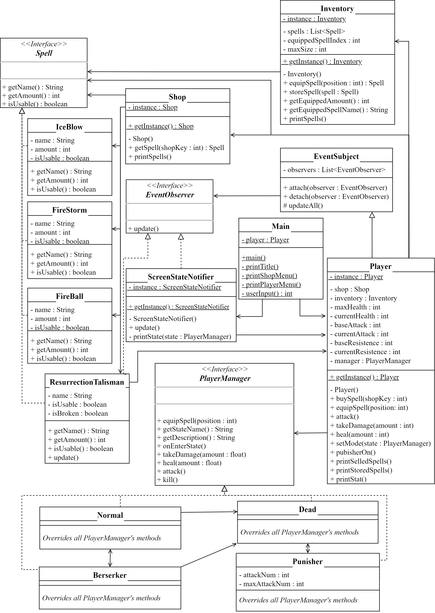

# Player_RPG
This is a Software Engineering Course project with the main purpose of making some design pattern work together.  
The software represents a portion of a RPG System, playable by a Text UI directly on your terminal.

## Features
It includes some of the most common features that you can find in an RPG game:
- Iventory system 
- Shop
- Usable Items 
- State changing player

## UML

